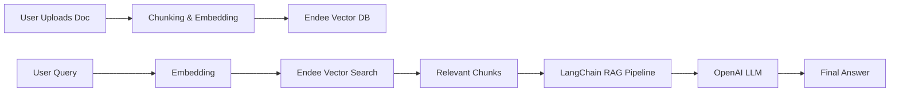

# Endee RAG: AI-Powered Semantic Search & Retrieval

A production-style RAG (Retrieval Augmented Generation) system built on the high-performance **Endee Vector Database**. This project demonstrates how to build a scalable document intelligence system that can ingest PDF/Text files, perform semantic search, and generate grounded AI answers.

## 🌟 Features

*   **Document Ingestion**: Supports PDF and Plain Text files.
*   **Intelligent Chunking**: Automatic text splitting with overlap for context preservation.
*   **Vector Embeddings**: High-quality local embeddings via `sentence-transformers`.
*   **Fast Retrieval**: Powered by [Endee](https://github.com/endee-io/endee) for ultra-low latency vector search.
*   **RAG Pipeline**: Integration with LangChain and OpenAI for accurate, grounded Q&A.
*   **Premium UI**: Sleek, modern dashboard built with Streamlit.

## 🏗️ System Architecture



## 🚀 How Endee is Used

Endee serves as the high-performance retrieval engine. It stores high-dimensional vector representations of document chunks and performs efficient similarity searches to find the most relevant context for any user query. Its architectural focus on SIMD optimizations (AVX2/NEON) ensures that retrieval scales gracefully with millions of vectors.

## 🛠️ Installation & Setup

### 1. Run Endee Server
Ensure you have the Endee server running locally (default port 8080).
```bash
# Fastest way via Docker
docker run -p 8080:8080 endeeio/endee-server:latest
```

### 2. Clone and Setup Environment
```bash
git clone https://github.com/yashlahase/endee.git
cd endee/endee_rag
python -m venv venv
source venv/bin/activate  # Mac/Linux
pip install -r requirements.txt
```

### 3. Configure `.env`
Create a `.env` file based on `.env.example`:
```env
OPENAI_API_KEY=sk-...
ENDEE_URL=http://localhost:8080
```

## 🏁 Running the Project

1. **Start the Backend API**:
```bash
# From endee_rag directory
python3 -m api.main
```

2. **Start the Streamlit UI**:
```bash
# From endee_rag directory
streamlit run ui/dashboard.py
```

## 📷 Screenshots
*Placeholder: Dashboard UI showing document upload and successful AI retrieval.*

## 📜 License
Apache License 2.0
